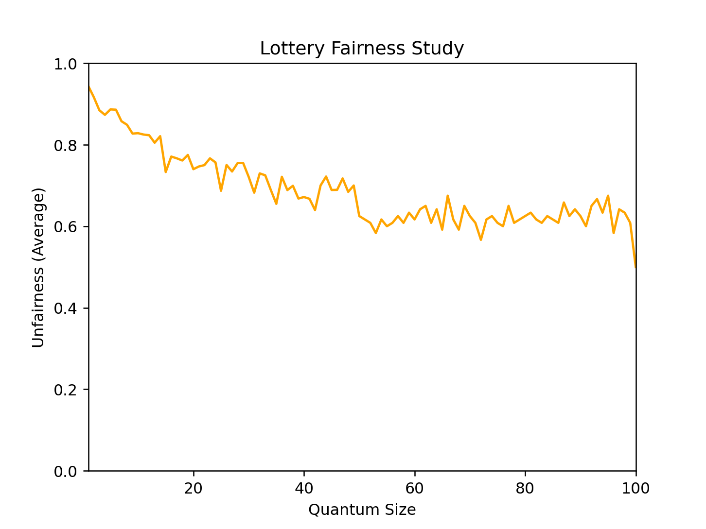
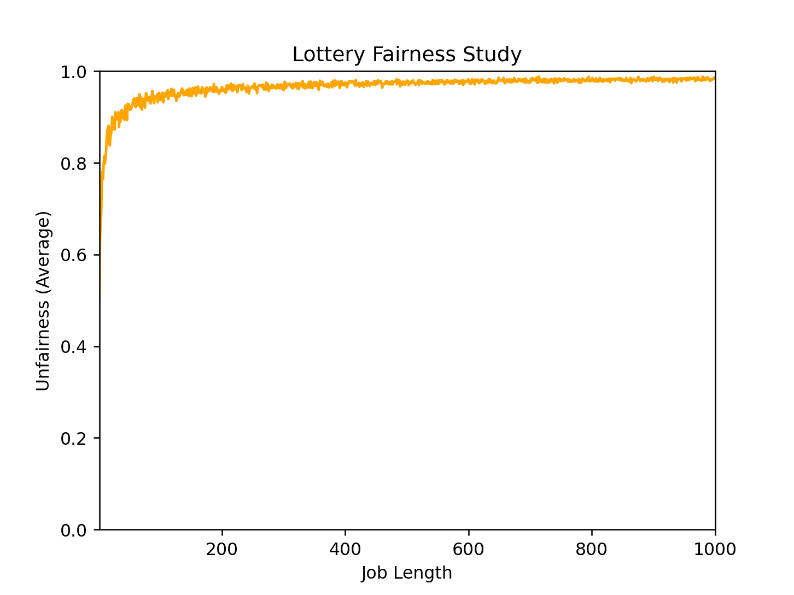
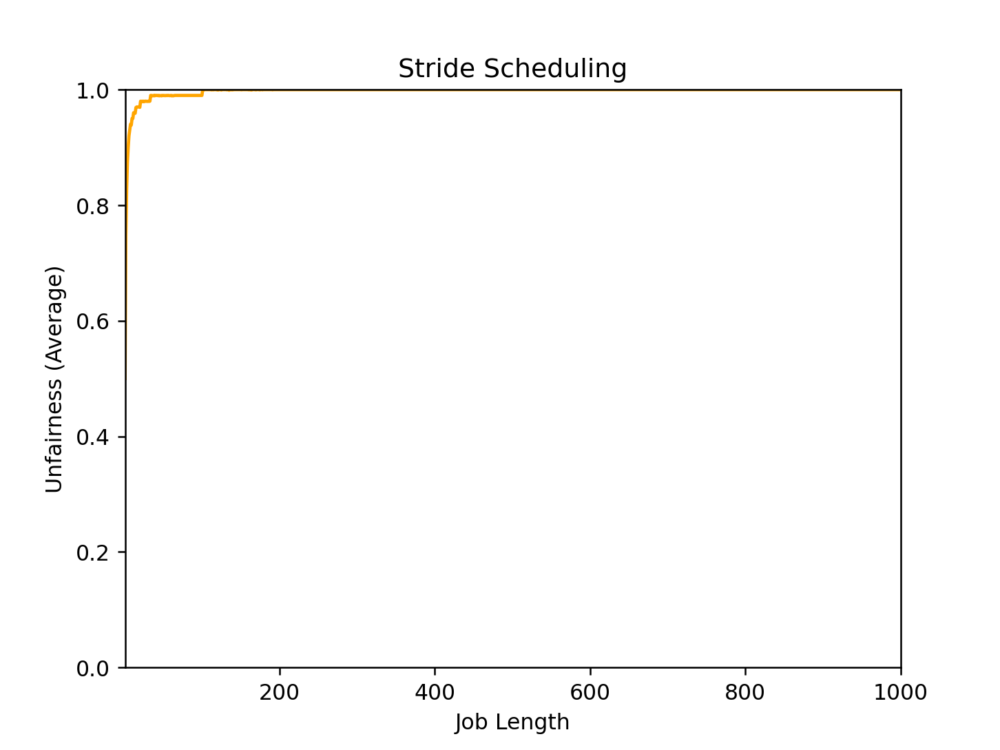

# 1

**Compute the solutions for simulations with 3 jobs and random seeds of 1, 2, and 3.**

## Seed 1

```
python lottery.py -s 1 -l 10:100,20:100 -c
```

```
JOB 0 DONE at time 22
JOB 1 DONE at time 30
```

## Seed 2

```
python lottery.py -s 2 -l 10:100,20:100 -c
```

```
JOB 0 DONE at time 19
JOB 1 DONE at time 30
```

## Seed 3

```
python lottery.py -s 3 -l 10:100,20:100 -c
```

```
JOB 0 DONE at time 20
JOB 1 DONE at time 30
```

# 2

**Now run with two specific jobs: each of length 10, but one (job 0) with just 1 ticket and the other (job 1) with 100 (e.g., -l 10:1,10:100). What happens when the number of tickets is so imbalanced? Will job 0 ever run before job 1 completes? How often? In general, what does such a ticket imbalance do to the behavior of lottery scheduling?**

```
python lottery.py -s 1 -l 10:1,10:100 -c
```

```
JOB 1 DONE at time 10
JOB 0 DONE at time 20
```

The chance that job 0 ran before job 1 is very low. The imbalance of the number of the tickets makes a job with high number almost always run before a job with low number.

# 3

**When running with two jobs of length 100 and equal ticket allocations of 100 (-l 100:100,100:100), how unfair is the scheduler? Run with some different random seeds to determine the (probabilistic) answer; let unfairness be determined by how much earlier one job finishes than the other.**

```
python lottery.py -l 100:100,100:100 -c -s <seed>
```

I tried seed from 1 to 10. The result is `-4 -10 4 -1 -19 -7 -15 -9 -8 3`. The average is `-6.6`

# 4

**How does your answer to the previous question change as the quantum size (-q) gets larger?**

I set the quantum size to 5. `10 25 15 15 -10 -30 50 -35 65 15`. The average is `12`.

Lesser quantum size is fairer

```
python ./plot_quantum.py
```



# 5

**Can you make a version of the graph that is found in the chapter?What else would be worth exploring? How would the graph look with a stride scheduler?**

```
python ./plot.py
```




```
python ./plot_stride.py
```



# References

The source code I got from [this link](https://github.com/xxyzz/ostep-hw/blob/master/9)