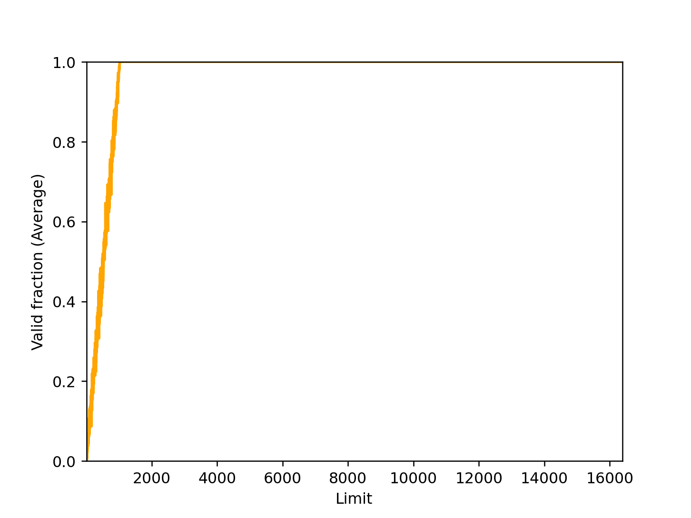

# 1

**Run with seeds 1, 2, and 3, and compute whether each virtual address generated by the process is in or out of bounds. If in bounds, compute the translation.**

## Seed 1

```
python relocation.py -s 1 -c
```

```
ARG seed 1
ARG address space size 1k
ARG phys mem size 16k

Base-and-Bounds register information:

  Base   : 0x0000363c (decimal 13884)
  Limit  : 290

Virtual Address Trace
  VA  0: 0x0000030e (decimal:  782) --> SEGMENTATION VIOLATION
  VA  1: 0x00000105 (decimal:  261) --> VALID: 0x00003741 (decimal: 14145)
  VA  2: 0x000001fb (decimal:  507) --> SEGMENTATION VIOLATION
  VA  3: 0x000001cc (decimal:  460) --> SEGMENTATION VIOLATION
  VA  4: 0x0000029b (decimal:  667) --> SEGMENTATION VIOLATION
```

## Seed 2

```
python relocation.py -s 2 -c
```

```
ARG seed 2
ARG address space size 1k
ARG phys mem size 16k

Base-and-Bounds register information:

  Base   : 0x00003ca9 (decimal 15529)
  Limit  : 500

Virtual Address Trace
  VA  0: 0x00000039 (decimal:   57) --> VALID: 0x00003ce2 (decimal: 15586)
  VA  1: 0x00000056 (decimal:   86) --> VALID: 0x00003cff (decimal: 15615)
  VA  2: 0x00000357 (decimal:  855) --> SEGMENTATION VIOLATION
  VA  3: 0x000002f1 (decimal:  753) --> SEGMENTATION VIOLATION
  VA  4: 0x000002ad (decimal:  685) --> SEGMENTATION VIOLATION
```

## Seed 3

```
python relocation.py -s 3 -c
```

```
ARG seed 3
ARG address space size 1k
ARG phys mem size 16k

Base-and-Bounds register information:

  Base   : 0x000022d4 (decimal 8916)
  Limit  : 316

Virtual Address Trace
  VA  0: 0x0000017a (decimal:  378) --> SEGMENTATION VIOLATION
  VA  1: 0x0000026a (decimal:  618) --> SEGMENTATION VIOLATION
  VA  2: 0x00000280 (decimal:  640) --> SEGMENTATION VIOLATION
  VA  3: 0x00000043 (decimal:   67) --> VALID: 0x00002317 (decimal: 8983)
  VA  4: 0x0000000d (decimal:   13) --> VALID: 0x000022e1 (decimal: 8929
```

# 2

**Run with these flags: -s 0 -n 10. What value do you have set -l (the bounds register) to in order to ensure that all the generated virtual addresses are within bounds?**

We need to set the base, bound value, address space size and phys mem size.

```
python relocation.py -s 1 -n 10 -c -a 16 -p 32 -b 8 -l 16
```

```
ARG seed 1
ARG address space size 16
ARG phys mem size 32

Base-and-Bounds register information:

  Base   : 0x00000008 (decimal 8)
  Limit  : 16

Virtual Address Trace
  VA  0: 0x00000002 (decimal:    2) --> VALID: 0x0000000a (decimal:   10)
  VA  1: 0x0000000d (decimal:   13) --> VALID: 0x00000015 (decimal:   21)
  VA  2: 0x0000000c (decimal:   12) --> VALID: 0x00000014 (decimal:   20)
  VA  3: 0x00000004 (decimal:    4) --> VALID: 0x0000000c (decimal:   12)
  VA  4: 0x00000007 (decimal:    7) --> VALID: 0x0000000f (decimal:   15)
  VA  5: 0x00000007 (decimal:    7) --> VALID: 0x0000000f (decimal:   15)
  VA  6: 0x0000000a (decimal:   10) --> VALID: 0x00000012 (decimal:   18)
  VA  7: 0x0000000c (decimal:   12) --> VALID: 0x00000014 (decimal:   20)
  VA  8: 0x00000001 (decimal:    1) --> VALID: 0x00000009 (decimal:    9)
  VA  9: 0x00000000 (decimal:    0) --> VALID: 0x00000008 (decimal:    8)
```

# 3 

**Run with these flags: -s 1 -n 10 -l 100. What is the maximum value that bounds can be set to, such that the address space still fits into physical memory in its entirety?**

I think the bound need to bigger than the biggest virtual address trace and smaller than the address space size.

The suitable range is [867, 1000]. I chose 900

```
python relocation.py -s 1 -n 10 -l 900 -c
```

```
ARG seed 1
ARG address space size 1k
ARG phys mem size 16k

Base-and-Bounds register information:

  Base   : 0x00000899 (decimal 2201)
  Limit  : 900

Virtual Address Trace
  VA  0: 0x00000363 (decimal:  867) --> VALID: 0x00000bfc (decimal: 3068)
  VA  1: 0x0000030e (decimal:  782) --> VALID: 0x00000ba7 (decimal: 2983)
  VA  2: 0x00000105 (decimal:  261) --> VALID: 0x0000099e (decimal: 2462)
  VA  3: 0x000001fb (decimal:  507) --> VALID: 0x00000a94 (decimal: 2708)
  VA  4: 0x000001cc (decimal:  460) --> VALID: 0x00000a65 (decimal: 2661)
  VA  5: 0x0000029b (decimal:  667) --> VALID: 0x00000b34 (decimal: 2868)
  VA  6: 0x00000327 (decimal:  807) --> VALID: 0x00000bc0 (decimal: 3008)
  VA  7: 0x00000060 (decimal:   96) --> VALID: 0x000008f9 (decimal: 2297)
  VA  8: 0x0000001d (decimal:   29) --> VALID: 0x000008b6 (decimal: 2230)
  VA  9: 0x00000357 (decimal:  855) --> VALID: 0x00000bf0 (decimal: 3056)
```

# 4

**Run some of the same problems above, but with larger address spaces (-a) and physical memories (-p).**

```
python relocation.py -s 1 -n 10 -l 900 -a 4k -p 32k -c
```

```
ARG seed 1
ARG address space size 4k
ARG phys mem size 32k

Base-and-Bounds register information:

  Base   : 0x00001132 (decimal 4402)
  Limit  : 900

Virtual Address Trace
  VA  0: 0x00000d8f (decimal: 3471) --> SEGMENTATION VIOLATION
  VA  1: 0x00000c38 (decimal: 3128) --> SEGMENTATION VIOLATION
  VA  2: 0x00000414 (decimal: 1044) --> SEGMENTATION VIOLATION
  VA  3: 0x000007ed (decimal: 2029) --> SEGMENTATION VIOLATION
  VA  4: 0x00000731 (decimal: 1841) --> SEGMENTATION VIOLATION
  VA  5: 0x00000a6c (decimal: 2668) --> SEGMENTATION VIOLATION
  VA  6: 0x00000c9e (decimal: 3230) --> SEGMENTATION VIOLATION
  VA  7: 0x00000180 (decimal:  384) --> VALID: 0x000012b2 (decimal: 4786)
  VA  8: 0x00000074 (decimal:  116) --> VALID: 0x000011a6 (decimal: 4518)
  VA  9: 0x00000d5f (decimal: 3423) --> SEGMENTATION VIOLATION
```

# 5

**What fraction of randomly-generated virtual addresses are valid,as a function of the value of the bounds register? Make a graph from running with different random seeds, with limit values ranging from 0 up to the maximum size of the address space.**

Bigger limit values, lower the invalid rate of randomly-generated virtual addresses are.

```
python plot.py
```

